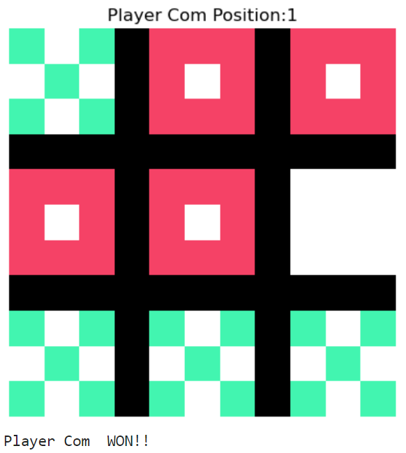
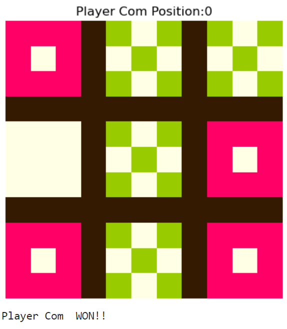
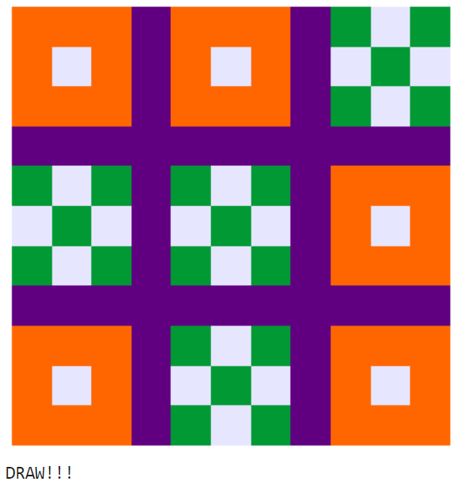

<h1>Intelligent Tic-Tac-Toe</h1>
A Python project that implements a fundamental concept in Artificial Intelligence (AI) i.e. the Minimax Algorithm
to play a game of Tic-Tac-Toe with the user. The Minimax Algorithm gives the computer a certain
level of intelligence so it always Wins or Draws but never Loses the game. NumPy and Matplotlib libraries are used to display
the tic-tac-toe grid to the user.
<h3>Technologies Used</h3>
<ul>
  <li>Python 3.11.3</li>
  <li>IDE- JupyterLab 3.5.4</li>
  <li>Libraries used-</li>
  <ul>
    <li>NumPy</li>
    <li>Matplotlib</li>
  </ul>
</ul>
<h3>The symbol, background, and border colors can be customized according to preference.</h3>
 
 

