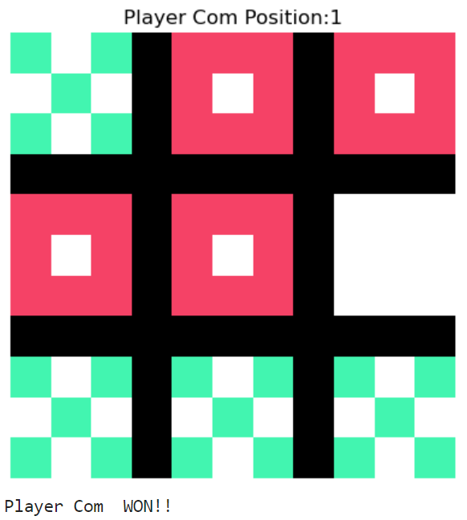
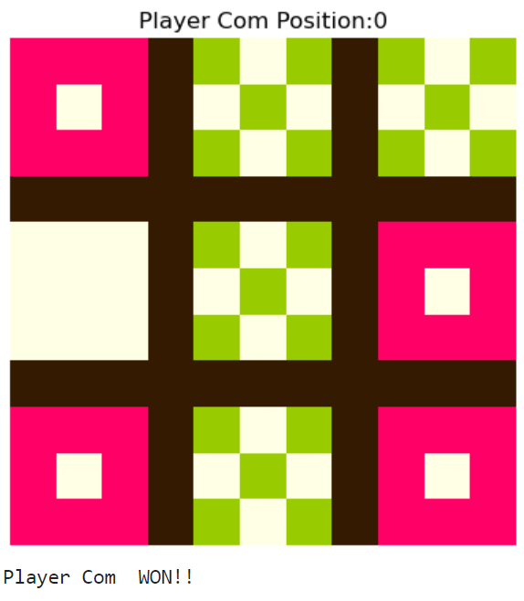
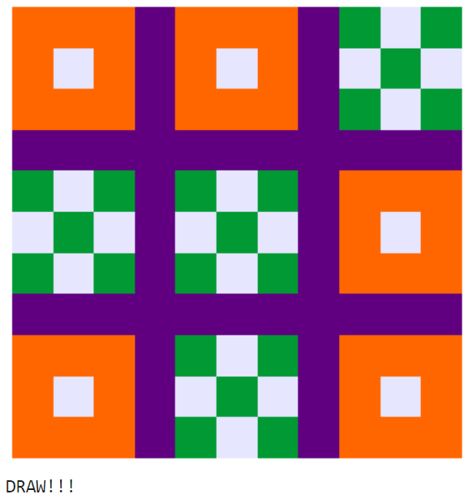

<h1>Intelligent Tic-Tac-Toe</h1>
<h3>The program uses the Minimax Algorithm to play the tic-tac-toe game against the user. The Algorithm makes it intelligent so the computer either wins or draws but never loses.</h2>
<h3>The symbol, background, and border colors can be customized according to preference.</h3>
 

